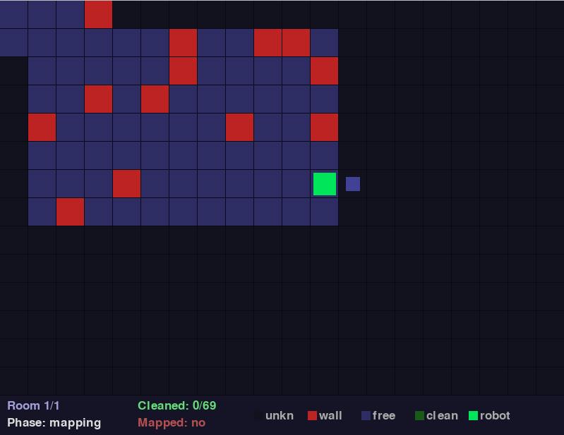
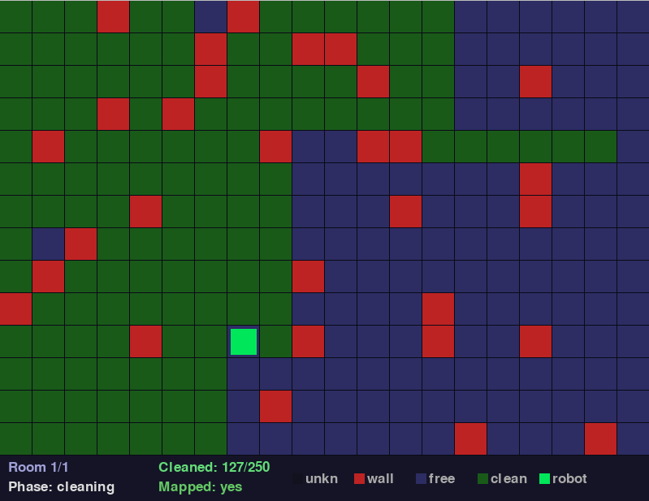

# Autonomous Robot Simulation

A 2D autonomous robot vacuum simulator written in Python. The robot operates entirely from its own internal memory - it has no prior knowledge of the environment and must first explore, then clean.


---

## Overview

The simulation demonstrates two core concepts from autonomous robotics:

- **Frontier-based exploration** - the robot incrementally builds a map of its environment by always navigating toward the nearest unknown cell
- **Optimal pathfinding** - once mapping is complete, the robot cleans every reachable tile using A* with a Manhattan distance heuristic

All decisions are made using only information the robot has discovered itself. No global map is available at runtime.

---

## Demo

| Mapping phase | Cleaning phase |
|---------------|----------------|
|  |  |

---

## How It Works

### Phase 1 - Mapping

The robot uses **BFS frontier exploration**. At each step it finds the shortest path to the nearest unknown cell reachable through already-known free space. A 3x3 sensor detects walls and free cells in the robot's immediate neighbourhood, updating the internal map without requiring the robot to step directly into every cell.

### Phase 2 - Cleaning

The robot uses **A\*** to navigate to uncleaned tiles. Candidates are sorted by Manhattan distance and evaluated in order. Any tile with no valid path is immediately marked as permanently unreachable, preventing the robot from wasting time on isolated areas.

### Room Memory

After the first full mapping pass, the completed map is stored in memory. Revisiting a room reuses the stored map and skips straight to cleaning.

---

## Features

- Autonomous two-phase operation with no human input during simulation
- BFS-based frontier exploration
- A* pathfinding with Manhattan heuristic
- 3x3 proximity sensor for wall and free-cell detection
- Isolated tile detection - unreachable areas identified and skipped automatically
- Room history with keyboard navigation - switch between rooms freely
- Repeat mode - replay a room using stored map, skipping remapping

---

## Controls

| Key | Action |
|-----|--------|
| `R` | Repeat current room (skips mapping if already done) |
| `N` | Generate a new random room |
| `Right arrow` | Next room |
| `Left arrow` | Previous room |

---

## Color Legend

| Color | Meaning |
|-------|---------|
| Dark | Unknown - not yet discovered |
| Red | Wall / obstacle |
| Blue-grey | Known free tile |
| Green | Cleaned tile |
| Bright green | Robot |

---

## Installation

```bash
git clone https://github.com/MateuszZas/autonomous-robot-simulation-py.git
cd autonomous-robot-simulation-py
pip install -r requirements.txt
python autonomous_robot_simulation.py
```

Requires Python 3.8 or newer.

---

## Project Structure

```
autonomous-robot-simulation-py/
|-- autonomous_robot_simulation.py   # simulation logic and rendering
|-- requirements.txt                 # dependencies (pygame)
|-- README.md
|-- LICENSE
```

---

## Algorithms

| Component | Algorithm | Complexity |
|-----------|-----------|------------|
| Exploration | BFS frontier search | O(V + E) |
| Pathfinding | A* with Manhattan heuristic | O(E log V) |
| Target selection | Linear scan + distance sort | O(n log n) |

---

## License

MIT - see [LICENSE](LICENSE).